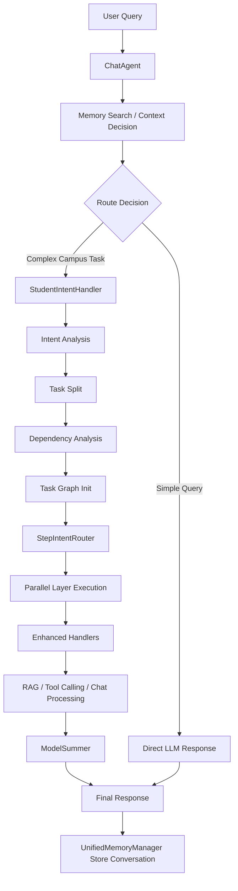

# TeacherMaxAI

TeacherMaxAI 是一个面向教学场景的智慧校园后端项目，基于 `Spring Boot 3 + Java 21 + MyBatis-Plus + Redis + LangChain4j` 构建，围绕“教学管理 + AI 助教 + RAG 知识检索 + 游戏化学习”展开。项目既包含常规的课程、章节、考试、用户管理能力，也实现了智能组卷、AI 判卷、教案生成、学情分析、流式聊天、知识库检索等增强能力。

这个仓库当前以后端服务为主，适合作为 AI 教育平台、智慧教学系统、课程实训项目的参考实现。

## 项目亮点

- 教学业务与 AI 能力深度结合，不是独立 Demo，而是直接融入课程、考试、教案、问答等场景。
- 使用 LangChain4j 构建聊天、工具调用、RAG 检索与向量存储链路。
- 支持增强型 RAG 检索，包含多策略召回、RRF 融合、查询扩展与效果评估。
- 支持 AI 辅助教师工作流，如智能组卷、智能判卷、班级学情分析、章节练习生成、教案生成。
- 集成 Redis、WebSocket/SSE、异步任务、延迟队列、分布式锁等常见工程能力。
- 包含游戏化学习模块，例如爬塔、战斗、排行榜、道具等，强化学习互动性。

## 核心功能

### 1. 教学管理

- 用户注册、登录、登出、密码重置
- 学生、教师、管理员三类角色管理
- 课程、章节、知识点、课件、教案、考试等教学资源管理
- 学习进度、答题记录、错题分析、成绩统计

### 2. AI 教学助手

- AI 自动判卷
- 智能创建试卷
- 班级学情分析报告生成
- 教师教案生成
- 章节练习题生成

### 3. 智能问答与 RAG

- 普通聊天与流式聊天
- 基于知识库的问答检索
- 多轮对话记忆管理
- 工具调用与联网搜索扩展
- 文档解析、分段、嵌入、向量检索

### 4. 游戏化学习

- 塔层创建与关卡推进
- 战斗与答题联动
- 排行榜与奖励机制
- 道具、Boss、玩家成长体系

### 5. 实时通信与互动

- WebSocket/SSE 流式推送
- 学生与教师聊天
- 在线状态管理
- 通知消息与会话未读数统计

## 技术栈

| 类别 | 技术 |
| --- | --- |
| 基础框架 | Spring Boot 3.4.5, Java 21 |
| Web 层 | Spring MVC, WebSocket, SSE |
| 数据访问 | MyBatis-Plus, MySQL |
| 缓存与并发 | Redis, Redisson, Async, Scheduling |
| AI 能力 | LangChain4j, DashScope, Pinecone |
| 文档处理 | Apache Tika, PDFBox, Apache POI |
| 工具库 | Hutool, Jackson, JJWT |
| 文件与云服务 | 阿里云 OSS, 邮件服务 |
| API 文档 | Knife4j / OpenAPI |
| 测试 | JUnit 5, Spring Boot Test |

## 架构概览

项目整体是典型的单体分层后端，但中间插入了独立的 AI 增强层：

1. `controller` 负责对外提供 REST 接口与流式接口。
2. `service` / `service.impl` 承载教学、聊天、AI、游戏化等业务逻辑。
3. `mapper` + `resources/mapper/*.xml` 负责数据库访问。
4. `model` / `handler` / `config` 构成 AI Agent、RAG、工具调用、记忆管理等核心能力。
5. `commons` 提供统一返回、工具类、限流、延迟任务、异常处理等基础设施。

从仓库当前代码量看，核心后端规模大致为：

- `26` 个控制器
- `22` 个服务接口
- `22` 个服务实现
- `39` 个 Mapper
- `40` 个测试类

## Agent 架构

这个项目的 AI 部分不是简单地“把大模型接进来”，而是做成了一条相对完整的 Agent 执行链路。代码里可以看到，它把用户请求分成了入口路由、意图拆解、任务调度、处理器执行、记忆检索、RAG 检索、工具调用和结果汇总几个阶段。

### 1. 总体思路

- `ChatAgent` 是统一对话入口。
- 它会先做记忆检索与上下文判断，再决定当前请求是直接走 LLM，还是走业务 Agent。
- 如果走业务 Agent，则由 `Intent` 接口的实现类 `StudentIntentHandler` 负责分析用户意图。
- `StudentIntentHandler` 会让模型把复杂请求拆成多个子任务，并进一步分析任务依赖关系。
- 子任务与依赖关系会被初始化成一张任务图，然后交给 `StepIntentRouter` 按层级调度。
- `StepIntentRouter` 的执行原则是“同层并行、跨层串行”，更适合处理有前后依赖的复杂请求。
- 每个任务最终会交给对应 Handler 执行，例如增强型 RAG Handler、函数调用 Handler、普通聊天 Handler 等。
- 执行结束后，再由总结模块把多步骤结果整理为最终回复。

### 2. 关键角色

| 模块 | 作用 |
| --- | --- |
| `ChatAgent` | 对话统一入口，负责记忆使用决策、LLM/Agent 路由、结果写回 |
| `UnifiedMemoryManager` | 管理多轮对话记忆，支持按相关度检索历史片段 |
| `StudentIntentHandler` | 负责意图理解、子任务拆分、任务依赖分析 |
| `TaskInitUtils` + `CreateDiagram` | 初始化任务图，维护子任务之间的依赖关系 |
| `StepIntentRouter` | 按 DAG 分层调度任务，同层并行、跨层串行 |
| `BaseEnhancedHandler` | Handler 执行基类，统一封装状态流转、异常与图状态更新 |
| `SeptIntentRagHandler` | 增强型 RAG 核心处理器，支持多策略检索与 RRF 融合 |
| `ChatChain` | 将基础聊天、RAG、函数调用串联成处理链 |
| `ChatAgentToolList` + `ToolInit` | 维护工具声明，承接天气、联网搜索等外部能力 |
| `ModelSummer` | 汇总多任务结果，生成最终对用户可读的答案 |

### 3. 处理流程



### 4. 架构特点

- 不是单轮 Prompt 直出，而是具备“分析 -> 拆分 -> 调度 -> 执行 -> 汇总”的 Agent 化特征。
- 用任务图而不是简单队列来管理复杂请求，适合处理有前置依赖的教学任务。
- 通过 `UnifiedMemoryManager` 只注入与当前问题相关的历史对话，尽量降低无关上下文带来的幻觉。
- 通过 `SeptIntentRagHandler` 的多策略检索与融合，提高知识库问答的召回率和相关性。
- 保留了工具调用扩展位，后续可以继续接教务系统、资源检索、通知、天气等外部能力。

## 主要代码目录

```text
src/main/java/com/aiproject/smartcampus
├── controller        # HTTP / SSE / 聊天 / 教学 / 游戏化接口
├── service           # 业务接口
├── service/impl      # 业务实现
├── mapper            # MyBatis-Plus Mapper
├── model             # AI Agent、RAG、工具调用、路由、记忆管理
├── handler           # 聊天链路、内容审查、记忆存储处理器
├── config            # Spring / AI / Redis / Web / Tool 初始化配置
├── interceptor       # 登录与刷新拦截器
├── commons           # 通用工具、返回体、异常处理、限流、缓存、异步工具
├── pojo              # DTO / VO / BO / PO / 枚举
└── test              # RAG 与 A/B 测试相关代码

src/main/resources
├── application.yaml  # 应用配置
└── mapper            # XML SQL 映射

src/test/java         # 单元测试与集成测试
documents             # 项目资料与知识库文档
```

## 代表性模块

### AI 与 RAG

- `ChatAgent`：统一对话入口，负责路由到直接 LLM 或业务 Agent，并控制记忆检索与写回。
- `ChatChain`：将基础聊天、RAG 检索、函数调用串成链式处理流程。
- `SeptIntentRagHandler`：增强型 RAG 处理器，包含多策略检索、结果融合、依赖任务处理等逻辑。
- `FileloadFunction`：多格式文档解析与切分，支持 PDF、Word、Excel、Markdown、代码文件等。
- `UnifiedMemoryManager`：管理多轮对话记忆、上下文检索与存储。
- `StudentIntentHandler`：负责用户意图拆解、子任务生成和任务依赖关系分析。
- `StepIntentRouter`：负责基于任务图进行分层并行调度。

### 教学业务

- `TeacherAIController` / `TeacherAIserviceImpl`：教师端 AI 能力总入口。
- `CourseController` / `ChapterController` / `KnowledgeController`：课程、章节、知识点与学习进度管理。
- `TeacherController` / `StudentController`：教师和学生侧核心业务接口。
- `MaterialController`：课程资料与教案管理。

### 游戏化学习

- `TowerController`：学习塔、楼层、剧情、进度等能力。
- `FightingController`：战斗流程、伤害、奖励、结果结算。
- `RankingListController`：排行榜与个人信息展示。

## 快速开始

### 环境要求

- JDK 21
- Maven 3.9+（或直接使用仓库内 `mvnw`）
- MySQL 8.x
- Redis 6.x 或以上

### 依赖的外部配置

启动前至少需要准备以下配置项：

- MySQL 连接信息
- Redis 连接信息
- `OTHER_DASHSCOPE_API_KEY`
- `PINECONE_API_KEY`
- 阿里云 OSS 配置
- 邮件服务配置
- 如需联网搜索，还需要对应的 Search API Key

建议把这些敏感信息改为环境变量或本地私有配置，不要直接使用仓库中的示例值。

### 本地启动

1. 克隆仓库并进入项目目录

```bash
git clone <your-repo-url>
cd TeacherMaxAI
```

2. 修改 `src/main/resources/application.yaml`

- 配置本地 MySQL、Redis、邮件、OSS 等连接信息
- 检查模型与向量库相关参数是否可用

3. 启动服务

```bash
./mvnw spring-boot:run
```

也可以先执行测试或编译：

```bash
./mvnw test
./mvnw -DskipTests package
```

### 默认访问地址

- 服务端口：`8108`
- API 文档：`http://localhost:8108/doc.html`

## 部分接口分组

项目接口较多，按照职责大致可以分为以下几类：

- `/common`：登录、注册、密码重置、登出
- `/course`：课程管理、选课、课程统计
- `/chapter`：章节学习、学习进度、章节练习
- `/knowledge`：知识点查询、编辑、出题
- `/teacher`：教师教学视图、考试发布、作业与成绩
- `/teacher/ai`：AI 判卷、组卷、学情分析、教案与练习生成
- `/chat`、`/api/chat`：普通聊天、流式聊天、SSE 事件推送
- `/studentteacher/chat`：师生聊天
- `/tower`、`/fighting`、`/rankinglist`：游戏化学习系统
- `/material`、`/upload`：资料与资源上传
- `/admin`：管理员资源与用户管理

## 测试与分析材料

仓库中除了常规测试外，还保留了与 RAG 效果评估相关的内容：

- `src/test/java`：单元测试与集成测试
- `src/main/java/com/aiproject/smartcampus/test/ab`：RAG A/B 测试代码
- `java_rag_ab_result.json`：RAG 测试结果
- `rag_ab_report.py`：RAG 报告脚本
- `项目分析与面试准备.md`、`代码缺陷分析与改进方案.md`：项目分析与改进文档

## 当前状态与注意事项

- 当前仓库更偏向“教学实训 / 毕设 / 原型系统”的工程实现，业务覆盖面较广。
- 一些配置仍带有本地开发或测试痕迹，公开到 GitHub 前建议先清理敏感配置。
- `WebInit` 中拦截器注册代码目前被注释，若用于正式环境，建议重新梳理认证与鉴权链路。
- 命名和模块划分整体已经具备分层结构，但仍有进一步拆分与重构空间。

## 适用场景

如果你正在做以下方向，这个项目会比较有参考价值：

- 智慧校园 / 智能教学平台
- AI+教育场景后端系统
- RAG 在教学知识库中的落地实践
- 基于 Java 的 LangChain4j 工程化应用
- 带有游戏化学习机制的课程平台
